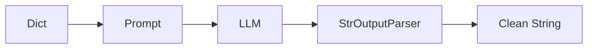

# Architecture: LCEL Pipelines

```
[ Input Dict ] ──► [ PromptTemplate ] ──► [ Gemini LLM ] ──► [ StrOutputParser ] ──► [ Plain String ]
```


```mermaid
graph LR
    A[Dict] --> B[Prompt]
    B --> C[LLM]
    C --> D[StrOutputParser]
    D --> E[Clean String]
```
