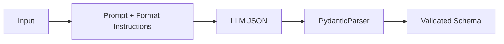

# Architecture: Structured Output Parsers

```
[ Input ] ──► [ Prompt with Format Instructions ] ──► [ LLM ] ──► [ PydanticOutputParser ] ──► [ Python Object ]
```


```mermaid
graph LR
    A[Input] --> B[Prompt + Format Instructions]
    B --> C[LLM JSON]
    C --> D[PydanticParser]
    D --> E[Validated Schema]
```
