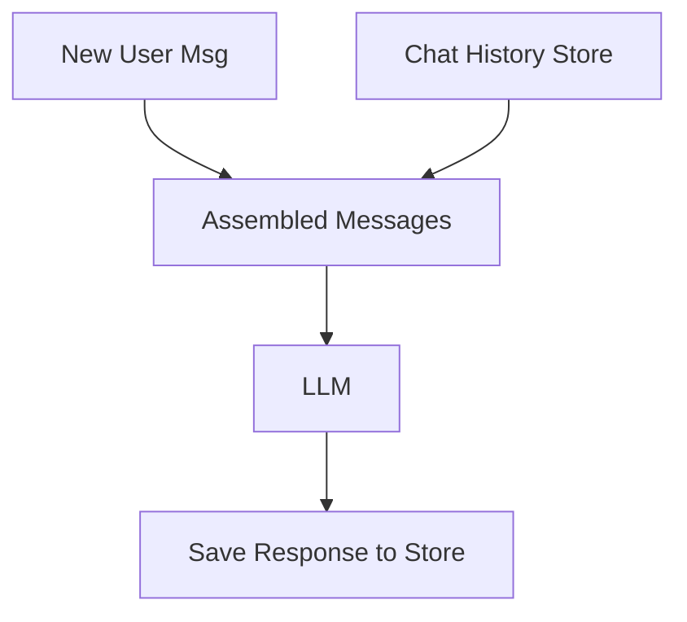

# Architecture: Memory and History

```
[ New Message ] + [ In-Memory History ] ──► [ ChatPromptTemplate ] ──► [ LLM ] ──► [ Updated History ]
```


```mermaid
graph TD
    A[New User Msg] --> C[Assembled Messages]
    B[Chat History Store] --> C
    C --> D[LLM]
    D --> E[Save Response to Store]
```
