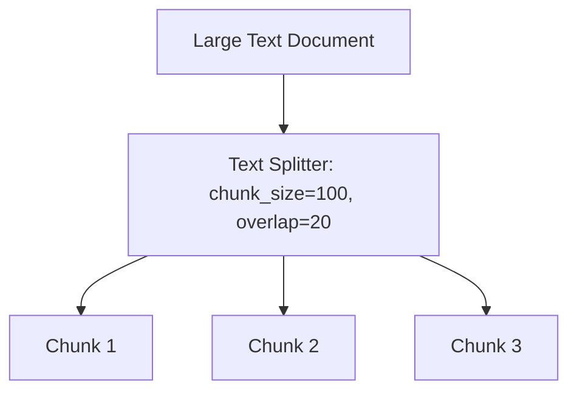

# Architecture: Chunking and Splitting

```
[ Raw Document ] ──► [ RecursiveCharacterTextSplitter ] ──► [ List of Document Chunks ]
```


```mermaid
graph TD
    A[Large Text Document] --> B[Text Splitter: chunk_size=100, overlap=20]
    B --> C[Chunk 1]
    B --> D[Chunk 2]
    B --> E[Chunk 3]
```
