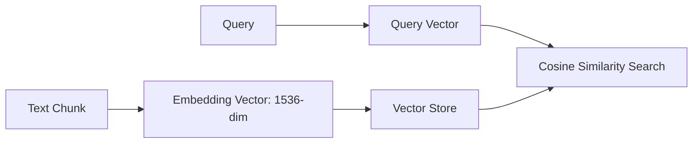

# Architecture: Embeddings and Vector DB

```
[ Text Chunks ] ──► [ Embedding Function ] ──► [ Dense Vectors ] ──► [ Vector Index / Dot Product ]
```


```mermaid
graph LR
    A[Text Chunk] --> B[Embedding Vector: 1536-dim]
    B --> C[Vector Store]
    D[Query] --> E[Query Vector]
    E --> F[Cosine Similarity Search]
    C --> F
```
