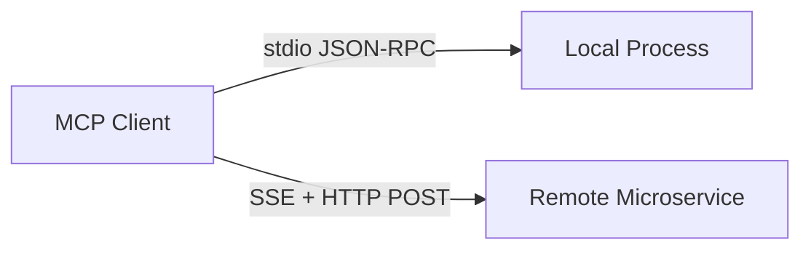

# Architecture: MCP Transports

```
[ Client ] ──(stdio: stdin/stdout)──► [ Local MCP Process ]
[ Client ] ──(HTTP POST / SSE)──────► [ Remote MCP Microservice ]
```


```mermaid
graph LR
    A[MCP Client] -->|stdio JSON-RPC| B[Local Process]
    A -->|SSE + HTTP POST| C[Remote Microservice]
```
