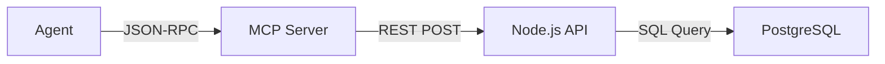

# Architecture: MCP to Node.js Backend

```
[ LLM / Agent ] ──(JSON-RPC)──► [ MCP Tool Adapter ] ──(HTTP REST)──► [ Node.js Service ] ──(SQL)──► [ Database ]
```


```mermaid
graph LR
    A[Agent] -->|JSON-RPC| B[MCP Server]
    B -->|REST POST| C[Node.js API]
    C -->|SQL Query| D[PostgreSQL]
```
